#  My Sql  Practice Note 

> ### Primary Key:- যে ফিল্ডের  সাহায্যের  প্রতিটি  রেকর্ড কে সনাক্ত করা হয় থাকে  প্রাইমারি কীয় বলে 
  

---
> ### Composite  Key:- 
> অনেক সময়  একটি ফিল্ডের সাহায্যের  প্রতিটি ফিল্ডের রেকর্ড পৃথকভাবে শনাক্ত করা  যায় না।  

তখন দুই বা ততোধিক কীয় ফিল্ডের সাহায্যের কম্পোসিট কী তৈরী করা হয়  রেকর্ড কে পৃথক করা জন্য 
  

----

> ### Foreign  Key:- 
> একটি টেবিল এর কী যদি অন্য টেবিল এর সাধারণ কী  হিসেবে ব্যবহার করা হয়  তখন  সাধারণ কী বা ফরেন কী বলে  
  

----
> ### Foreign  Key:- 
> একটি টেবিল এর কী যদি অন্য টেবিল এর সাধারণ কী  হিসেবে ব্যবহার করা হয়  তখন  সাধারণ কী বা ফরেন কী বলে  
  

----

> ## Show Command -> কি কি ডাটাবেস আছে  তা দেখার জন্য  ব্যবহার করা হয় 
>  SHOW database 

----

> ## Create Command -> ডাটাবেস তৈরির জন্য  ব্যবহার করা হয় 
>  CREATE  database 
----

> ## Drop  Command -> কোনো ডাটাবেস কে ডিলিট  করার জন্য  ব্যবহার করা হয় 
>  DROP  database 

----

 
-----
 
-----

 
-----

 
-----

> ## Create  Table - ডাটাবেস এর টেবিল এর  কলাম তৈরী করার জন্য ব্যবহার করা হয় 
 
-----

> ## Rename  Table -ডাটাবেসে এ  টেবিল এর নাম   পরিবর্তন করতে  ব্যবহার করা হয় 
 
-----

> ## Drop   Table -ডাটাবেসে এ  টেবিল এর নাম   ডিলিট  করতে  ব্যবহার করা হয় 
 
-----

> ## Table Insert Value টেবিল এর  কলাম  এর ডাটা Insert   করতে  ব্যবহার  করা হয় 
> 
 

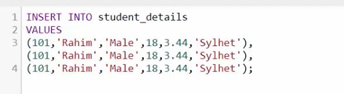 
-----

> ## Select Data   টেবিল এর  কলাম  এর ডাটা Get   করতে  ব্যবহার  করা হয় 
> 
 

 

> ## Select Data with Limit    টেবিল এর  কলাম  এর ডাটা  Limit Get   করতে  ব্যবহার  করা হয় 
> 
 

> ## DISTINCT :- টেবিল এর  নির্দিষ্ট কলাম এর  মিল থাকা ডাটা শুধুমাত্র  একবার দেখার  জন্য  ব্যবহার করা হয় 

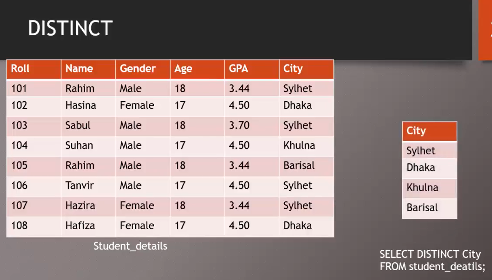 

> ## DISTINCT :- টেবিল এর  নির্দিষ্ট কলাম এর  মিল থাকা ডাটা শুধুমাত্র  একবার দেখার  জন্য  ব্যবহার করা হয় 

 

> ## Order by :-  ডাটা গুলো  নির্দিষ্ট করে  সাজানোর জন্য  ব্যবহার করা হয় 
 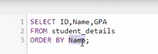 
 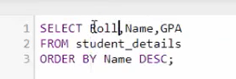 
 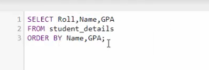 

 --- 

  

 -----

 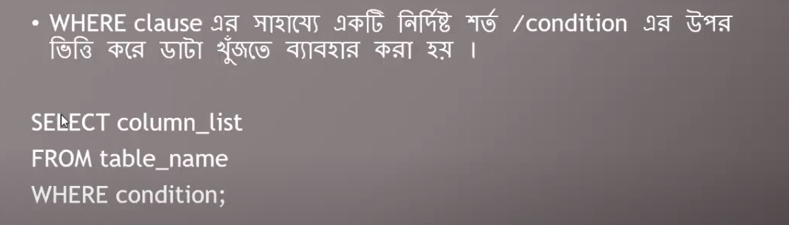 
 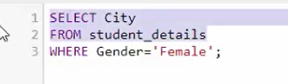 
 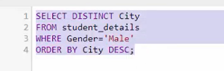 

-----

> ## Between :- কত ডাটা থেকে কত পর্যন্ত কোনো  নির্দিষ্ট  শর্ত দেওয়া  থাকে 
 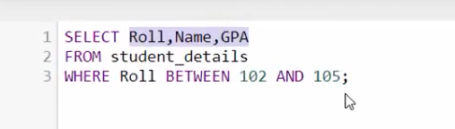 

 > ## Operator 
 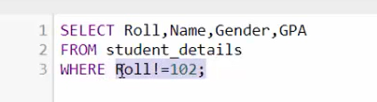 
 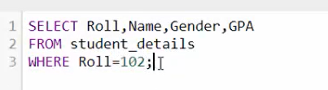 
 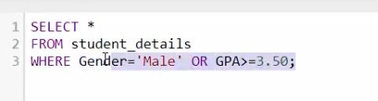 
 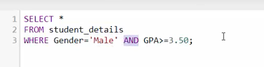 
 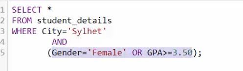 
 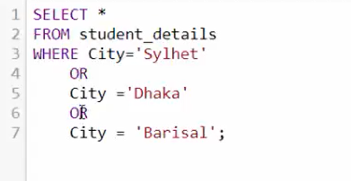 
 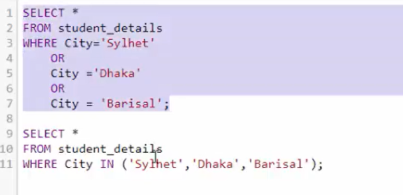 
 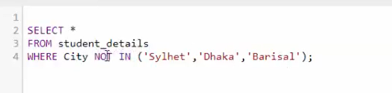 

 > ## Like  
 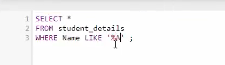 
 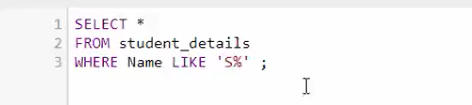 
 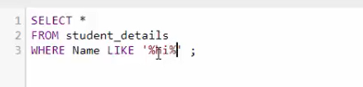 
 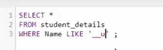 

----
 > ## Update   
  
  

----
 > ## Deletet    
 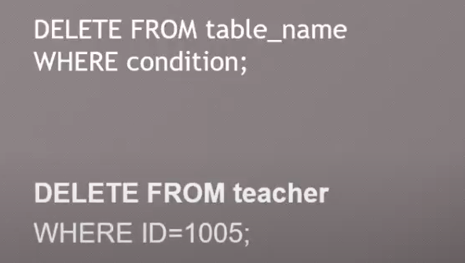 
  

----
 > ## Concate     
 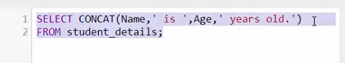 
 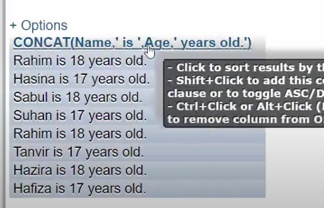 

 ----

 > ## As 
 
 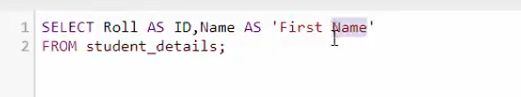 

 > ## Greatest and Less      
 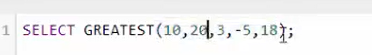 
 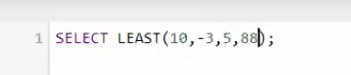 
 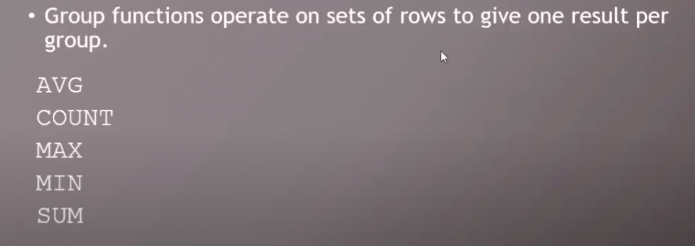 

---

 > ## Upper      
 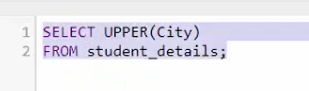 
 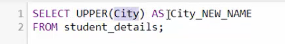 

---

 > ## Agregate Functions       
 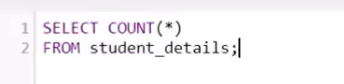 
  
  
 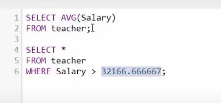 
 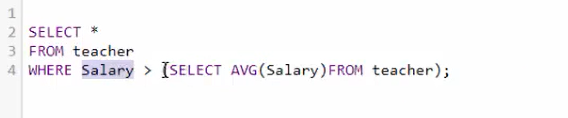 

 > ## Alter  Functions       
 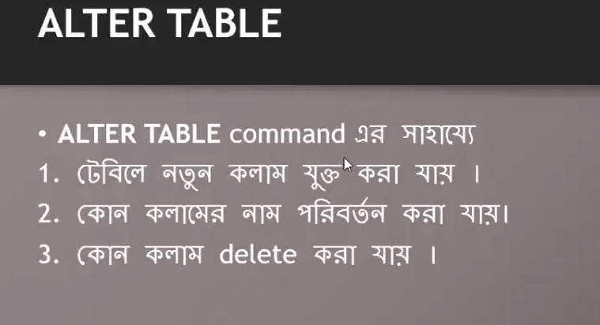 
 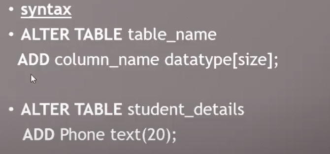 
 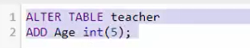 
 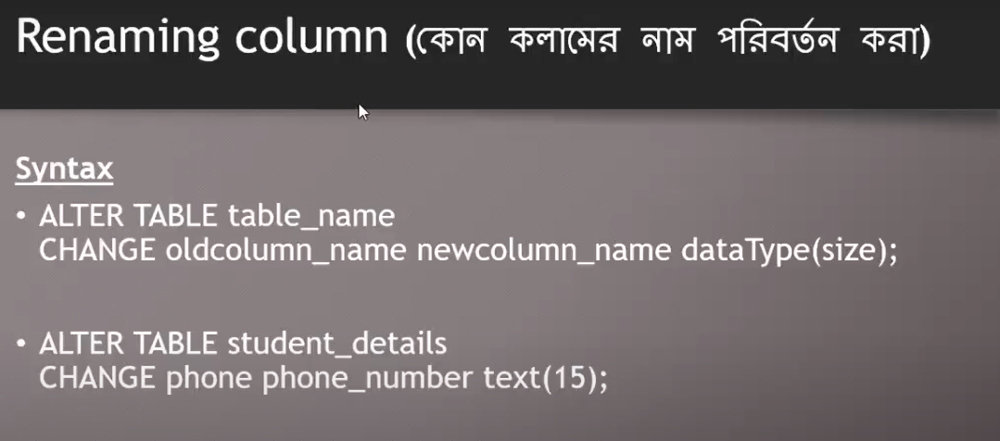 
 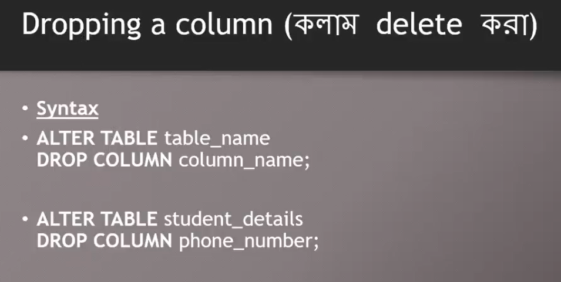 

 > ## Group by        
 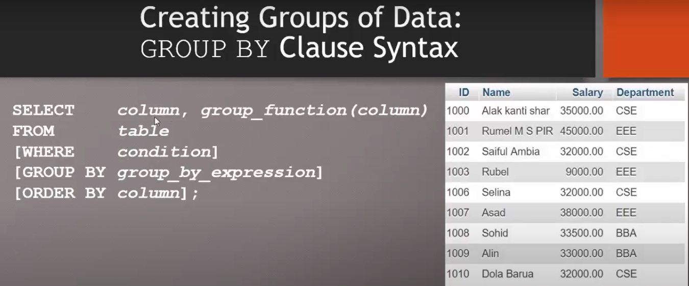 
 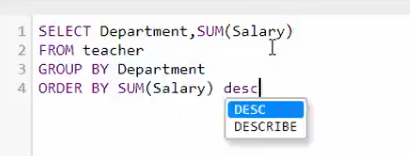 
 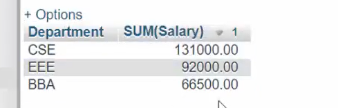 

> ## Truncate        
 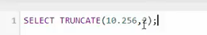 
 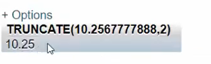 

